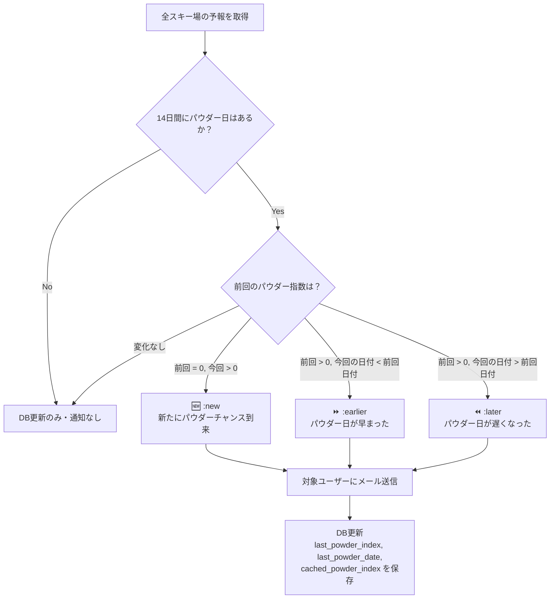
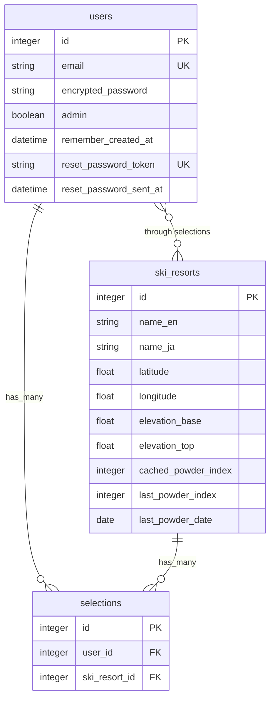
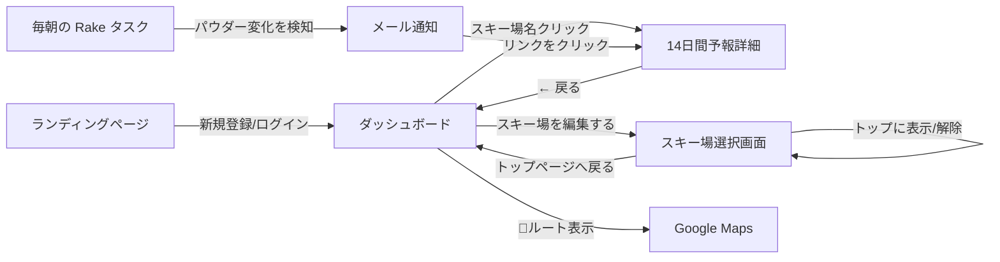

# 🏔️ Powder Hunter ― アプリケーション仕様書

> バックカントリースキー・スノーボード愛好者向けに、日本全国のスキー場の **パウダースノー予報** をリアルタイム提供する Web アプリケーション。

---

## 1. アプリ概要

| 項目 | 内容 |
|---|---|
| **フレームワーク** | Ruby on Rails 8.1 |
| **認証** | Devise（メール＋パスワード認証） |
| **外部API** | [Open-Meteo API](https://api.open-meteo.com)（天気予報取得、無料・API Key不要） |
| **地図** | Leaflet.js + OpenStreetMap |
| **メール送信** | ActionMailer（Gmail SMTP経由） |
| **デプロイ** | Render.com（render.yaml による構成管理） |
| **対象スキー場** | 日本全国14箇所（北海道〜新潟・長野・群馬・岩手・青森） |

---

## 2. 画面構成と機能詳細

### 画面① ランディングページ（未ログイン時のトップ `/`）

```
┌──────────────────────────────────────────────┐
│ nav:  [Powder Hunter ロゴ]    [ログイン] [新規登録] │
│                                              │
│          ┌─────────────────────┐              │
│          │  背景: スライドショー   │              │
│          │  (3枚の山岳写真が     │              │
│          │   18秒周期で切替)     │              │
│          └─────────────────────┘              │
│                                              │
│             POWDER HUNTER                    │
│    「日本のバックカントリーで、                    │
│      最高のパウダースノーに出会おう。」            │
│    「14日間の天気予報から、パウダー日を自動検出。」  │
│                                              │
│    [🏔️ 14スキー場] [📊 パウダー指数] [📧 自動通知]│
│                                              │
│    [ 全スキー場のパウダー情報を見る → ]           │
│                                              │
└──────────────────────────────────────────────┘
```

**主な特徴:**
- フルスクリーンの背景スライドショー（3枚、CSSアニメーション）
- グラスモーフィズム風のフィーチャーバッジ（14スキー場 / パウダー指数 / 自動通知）
- CTAボタンクリックで全スキー場一覧（`/resorts`）へ遷移
- ログイン済みユーザーは自動的に `/resorts`（ダッシュボード）にリダイレクト

---

### 画面② ダッシュボード（ログイン済み `/resorts`）

```
┌──────────────────────────────────────────────────────┐
│ header:                                              │
│   [管理画面(※admin)] [表示するスキー場を編集する]         │
│   user@example.com さん | [ログアウト]                  │
│                                                      │
│              Powder Hunter                           │
│   Find the best backcountry powder snow courses      │
├──────────────────────────────────────────────────────┤
│                                                      │
│  ┌──────────────┐ ┌──────────────┐ ┌──────────────┐  │
│  │   🏔️ POWDER!  │ │  ❄️ SNOWING   │ │     ⛄️      │  │
│  │              │ │              │ │              │  │
│  │ ニセコユナイテッド│ │ 白馬バレー    │ │ 妙高杉ノ原   │  │
│  │              │ │              │ │              │  │
│  │ Powder Index:│ │ Powder Index:│ │ Powder Index:│  │
│  │  72 / 100   │ │  25 / 100   │ │   0 / 100   │  │
│  │              │ │              │ │              │  │
│  │ Next 24h:   │ │ Next 24h:   │ │ Next 24h:   │  │
│  │  40 cm      │ │  15 cm      │ │   0 cm      │  │
│  │              │ │              │ │              │  │
│  │ 気温:        │ │ 気温:        │ │ 気温:        │  │
│  │ -8°C / -2°C │ │ -3°C / 1°C  │ │  2°C / 8°C  │  │
│  │              │ │              │ │              │  │
│  │ 直近チャンス:  │ │ 直近チャンス:  │ │ 直近14日に   │  │
│  │ 2月25日      │ │ 3月1日       │ │ パウダー予報  │  │
│  │ (指数: 72)   │ │ (指数: 25)   │ │ はありません   │  │
│  │              │ │              │ │              │  │
│  │ Elev: 300m  │ │ Elev: 750m  │ │ Elev: 731m  │  │
│  │              │ │              │ │              │  │
│  │[🚗ルート表示] │ │[🚗ルート表示] │ │[🚗ルート表示] │  │
│  └──────────────┘ └──────────────┘ └──────────────┘  │
│                                                      │
└──────────────────────────────────────────────────────┘
```

**表示内容（各カード）:**

| 項目 | 説明 |
|---|---|
| **絵文字アイコン** | パウダー指数 >50 → 🏔️ POWDER! / >0 → ❄️ SNOWING / 0 → ⛄️ |
| **スキー場名** | クリックで14日間予報の詳細画面へ遷移 |
| **Powder Index** | パウダー指数（0〜100） |
| **Next 24h Snow** | 直近24時間の予想降雪量（cm） |
| **Expected Temp** | 予想最低/最高気温 |
| **直近のチャンス** | 今後14日間で最初にパウダー指数 >0 となる日付と指数 |
| **🚗 ルート表示** | ブラウザの位置情報を取得し、Google Mapsで運転ルートを表示 |

**動作ルール:**
- 未ログインユーザー：全スキー場を表示
- ログイン済みユーザー：自分が選択した最大3つのスキー場のみ表示
- 未選択時は「まだスキー場が選択されていません」メッセージと選択画面へのリンクを表示
- カードはパウダー指数の高い順にソート

---

### 画面③ スキー場選択画面（ログイン必須 `/selections`）

```
┌──────────────────────────────────────────────────────┐
│  表示するスキー場を選ぶ（最大3つ）                        │
│                        現在の選択数: 1 / 3              │
│                        [トップページへ戻る]              │
├──────────────────────────────────────────────────────┤
│                                                      │
│  ┌────────────────────────────────────────────────┐   │
│  │           OpenStreetMap 日本地図                 │   │
│  │                                                │   │
│  │      📍八甲田                                   │   │
│  │                                                │   │
│  │  📍ニセコ    📍旭岳  📍黒岳                      │   │
│  │                                                │   │
│  │       📍キロロ  📍富良野                          │   │
│  │                        📍雫石  📍夏油高原         │   │
│  │                                                │   │
│  │       📍アライ 📍妙高 📍かぐら                    │   │
│  │              📍野沢  📍谷川岳                     │   │
│  │       📍白馬                                    │   │
│  │                                                │   │
│  │  ※ ピンクリック → ポップアップで選択/解除可能        │   │
│  └────────────────────────────────────────────────┘   │
│                                                      │
│  ┌──────────┐ ┌──────────┐ ┌──────────┐              │
│  │ニセコユナイテッド│ │白馬バレー  │ │野沢温泉    │ ...       │
│  │Niseko United│ │Hakuba    │ │Nozawa    │              │
│  │標高: 300m  │ │標高: 750m│ │標高: 565m│              │
│  │            │ │          │ │          │              │
│  │ [✅ 解除]  │ │[トップに表示]│ │[トップに表示]│             │
│  └──────────┘ └──────────┘ └──────────┘              │
└──────────────────────────────────────────────────────┘
```

**動作ルール:**
- Leaflet.js による日本地図上にスキー場のマーカーを表示
- マーカーのポップアップからも「選択」「解除」操作が可能
- グリッドリストからも「トップに表示」で選択、「解除」で解除
- 最大3つまで選択可能。3つ選択済みの場合は「上限（3つ）到達」と表示されボタン無効化
- 選択数カウンターがリアルタイム表示（ `現在の選択数: X / 3`）

---

### 画面④ 14日間予報詳細（`/resorts/:id`）

```
┌──────────────────────────────────────────────────────┐
│ header:                                              │
│          ニセコユナイテッド                              │
│     Elevation: 300m | Lat: 42.8688 | Lon: 140.6974   │
├──────────────────────────────────────────────────────┤
│                                                      │
│            [← 戻る (Back to Resorts)]                │
│                                                      │
│            14-Day Powder Forecast                    │
│                                                      │
│  ┌────────┬──────────┬────────────┬──────────┐       │
│  │ 日付    │ 天気      │ 最低/最高気温 │パウダー指数│       │
│  ├────────┼──────────┼────────────┼──────────┤       │
│  │2026-02-24│ ❄️ 8 cm │ -8°C / -2°C │  12 / 100│       │
│  │2026-02-25│ 🏔️ 40 cm│ -10°C / -5°C│  72 / 100│ ← 強調 │
│  │2026-02-26│ ❄️ 3 cm │ -5°C / 0°C  │   6 / 100│       │
│  │2026-02-27│ ⛄️ 0 cm │ -2°C / 3°C  │   0 / 100│       │
│  │  ...     │  ...    │    ...     │   ...    │       │
│  │2026-03-09│ ☀️ 0 cm │  2°C / 8°C  │   0 / 100│       │
│  └────────┴──────────┴────────────┴──────────┘       │
│                                                      │
│  ※ パウダー指数 50超の行は青色で強調表示                  │
│                                                      │
└──────────────────────────────────────────────────────┘
```

**天気絵文字の判定ロジック:**

| 条件 | 絵文字 |
|---|---|
| パウダー指数 > 50 | 🏔️ |
| 降雪量 > 0 | ❄️ |
| 最高気温 > 5°C | ☀️ |
| その他 | ⛄️ |

---

### 画面⑤ 管理者画面（admin権限必須 `/admin/ski_resorts`）

```
┌──────────────────────────────────────────────────────────────┐
│  スキー場管理 (Admin)       [🔄 Last Index 全リセット] [新規追加]│
├──────────────────────────────────────────────────────────────┤
│                                                              │
│ ┌────────┬────────┬───────┬───────┬───────┬────────┬────┬──┐ │
│ │日本語名 │英語名   │Current│Last   │Last   │緯度/経度│標高 │操作│ │
│ │        │        │Index  │Index  │Date   │        │    │   │ │
│ ├────────┼────────┼───────┼───────┼───────┼────────┼────┼──┤ │
│ │ニセコ   │Niseko..│ [72]  │ [0]   │ —     │42.8/140│300m│編集│ │
│ │        │        │(緑)   │(灰)   │       │        │/1308│削除│ │
│ ├────────┼────────┼───────┼───────┼───────┼────────┼────┼──┤ │
│ │白馬     │Hakuba..│ [25]  │ [18]  │2月20日│36.7/137│750m│編集│ │
│ │        │        │(青)   │(青)   │       │        │/1831│削除│ │
│ │ ...    │ ...    │ ...   │ ...   │ ...   │ ...    │... │...│ │
│ └────────┴────────┴───────┴───────┴───────┴────────┴────┴──┘ │
│                                                              │
│  ← トップページに戻る                                         │
└──────────────────────────────────────────────────────────────┘
```

**管理画面の機能:**
- スキー場のCRUD操作（新規追加 / 編集 / 削除）
- 編集項目：英語名、日本語名、緯度、経度、標高（Base/Top）、Current Index、Last Index、Last Powder Date
- 「Last Index 全リセット」ボタン：全スキー場の `last_powder_index` を `0` に一括リセット（確認ダイアログ付き）
- Current Index のバッジカラー：指数 >50=緑 / >0=青 / 0=灰

---

### 画面⑥ メール通知

```
━━━━━━━━━━━━━━━━━━━━━━━━━━━━━━━━━━━━━━

件名パターン①（新規チャンス）:
  【Powder Hunter】ニセコユナイテッドにパウダーチャンス到来！
  
件名パターン②（複数リゾート）:
  【Powder Hunter】登録した3箇所のスキー場にパウダー情報更新！

件名パターン③（日付が早まった場合）:
  【Powder Hunter】パウダーチャンス日が早まりました！

件名パターン④（日付が遅れた場合）:
  【Powder Hunter】パウダーチャンス日が遅れそうです！

━━━━━━━━━━━━━━━━━━━━━━━━━━━━━━━━━━━━━━

user@example.com 様

Powder Hunterからの最新のパウダー情報です！

--------------------------------------------------
【スキー場】 ニセコユナイテッド
🆕 新たにパウダーチャンスが到来しました！
【パウダー到来日】 2月25日
【パウダー指数】 72 / 100
詳細: https://powderhunter.com/resorts/1
--------------------------------------------------
【スキー場】 白馬バレー
⏩ パウダーチャンス日が早まりました！（前回: 3月3日 → 今回: 2月28日）
【パウダー到来日】 2月28日
【パウダー指数】 35 / 100
詳細: https://powderhunter.com/resorts/2
--------------------------------------------------

--
Powder Hunter
```

---

## 3. パウダー指数の計算ロジック

パウダー指数は **Open-Meteo API** から取得した14日間の日次予報データに基づいて算出されます。

### 計算式

```
① 気温ペナルティ = 最高気温 > 0°C の場合 → 最高気温 × 2、それ以外 → 0
② 基礎値 = 降雪量(cm) − 気温ペナルティ
③ パウダー指数 = 基礎値 > 0 の場合 → min(基礎値 × 2, 100)、それ以外 → 0
```

### 計算例

| ケース | 降雪量 | 最高気温 | ペナルティ | 基礎値 | パウダー指数 |
|---|---|---|---|---|---|
| 大雪＆低温 | 40 cm | -5°C | 0 | 40 | **80** |
| 中雪＆やや暖 | 15 cm | 2°C | 4 | 11 | **22** |
| 少雪＆暖かい | 5 cm | 5°C | 10 | -5 | **0** |
| 降雪なし | 0 cm | -3°C | 0 | 0 | **0** |

### 設計意図
- **降雪量が多い** ほどパウダー指数が高くなる
- **最高気温が0°Cを超える** と雪質が悪化するためペナルティを付与
- 上限100で正規化し、ユーザーが直感的に比較しやすくする

---

## 4. メール通知の仕組み（`powder:check` Rakeタスク）

### 実行タイミング
毎朝自動実行（Render.com の Cron Job で `rake powder:check` を定期実行）

### 判定ロジック



### 通知対象
- そのスキー場を「お気に入り」に登録しているユーザー全員
- 1ユーザーに対して、複数スキー場分の情報を **1通のメールにまとめて** 送信

### DB保存フィールド（毎日更新）

| フィールド | 用途 |
|---|---|
| `cached_powder_index` | 当日のパウダー指数（選択画面の地図ポップアップ等で使用） |
| `last_powder_index` | 14日間で最初のパウダー日の指数（翌日の比較基準） |
| `last_powder_date` | 14日間で最初のパウダー日の日付（翌日の比較基準） |

---

## 5. データモデル

### ER図



### バリデーション
- `Selection`: ユーザーごとに最大3つまで（`validate_selection_limit`）
- `Selection`: 同じユーザー×スキー場の重複不可（`uniqueness: { scope: :user_id }`）
- `User`: Devise の validatable（email, password の標準バリデーション）

---

## 6. 登録スキー場一覧（14箇所）

| # | 日本語名 | 英語名 | 地域 | 標高(Base/Top) |
|---|---|---|---|---|
| 1 | ニセコユナイテッド | Niseko United | 北海道 | 300m / 1,308m |
| 2 | 白馬バレー | Hakuba Valley | 長野 | 750m / 1,831m |
| 3 | 野沢温泉スキー場 | Nozawa Onsen | 長野 | 565m / 1,650m |
| 4 | 妙高杉ノ原 | Myoko Suginohara | 新潟 | 731m / 1,855m |
| 5 | 八甲田スキー場 | Hakkoda Ski Area | 青森 | 660m / 1,324m |
| 6 | かぐらスキー場 | Kagura Ski Resort | 新潟 | 620m / 1,845m |
| 7 | 谷川岳天神平スキー場 | Tanigawadake Tenjindaira | 群馬 | 1,319m / 1,500m |
| 8 | 大雪山旭岳 | Asahidake Ropeway | 北海道 | 1,100m / 1,600m |
| 9 | 大雪山黒岳 | Kurodake Ropeway | 北海道 | 670m / 1,300m |
| 10 | 富良野スキー場 | Furano Ski Resort | 北海道 | 235m / 1,209m |
| 11 | キロロスノーワールド | Kiroro Snow World | 北海道 | 570m / 1,180m |
| 12 | ロッテアライリゾート | Lotte Arai Resort | 新潟 | 329m / 1,429m |
| 13 | 雫石スキー場 | Shizukuishi Ski Resort | 岩手 | 430m / 1,126m |
| 14 | 夏油高原スキー場 | Geto Kogen Resort | 岩手 | 400m / 830m |

---

## 7. API連携（Open-Meteo）

### エンドポイント
```
GET https://api.open-meteo.com/v1/forecast
```

### リクエストパラメータ
| パラメータ | 値 |
|---|---|
| `latitude` | 複数スキー場の緯度をカンマ区切り |
| `longitude` | 複数スキー場の経度をカンマ区切り |
| `elevation` | 複数スキー場の `elevation_base` をカンマ区切り |
| `hourly` | `temperature_2m,snowfall` |
| `daily` | `snowfall_sum,temperature_2m_max,temperature_2m_min` |
| `timezone` | `auto` |
| `forecast_days` | `14` |

### キャッシュ戦略
- `Rails.cache.fetch` で **3時間** キャッシュ
- キャッシュキーはリクエストするスキー場IDの組み合わせで一意化
- 1ユーザーの表示は最大3スキー場なので、1回のAPIコールで全データ取得

---

## 8. ルーティング一覧

| HTTPメソッド | パス | コントローラ#アクション | 説明 |
|---|---|---|---|
| GET | `/` | `home#index` | ランディングページ（未ログイン） / リダイレクト（ログイン済み） |
| GET | `/resorts` | `resorts#index` | ダッシュボード（パウダー予報一覧） |
| GET | `/resorts/:id` | `resorts#show` | 14日間予報詳細 |
| GET | `/selections` | `selections#index` | スキー場選択画面（地図付き） |
| POST | `/selections` | `selections#create` | スキー場をお気に入りに追加 |
| DELETE | `/selections/:id` | `selections#destroy` | スキー場をお気に入りから解除 |
| GET | `/admin/ski_resorts` | `admin/ski_resorts#index` | 管理画面一覧 |
| GET | `/admin/ski_resorts/new` | `admin/ski_resorts#new` | スキー場新規追加 |
| POST | `/admin/ski_resorts` | `admin/ski_resorts#create` | スキー場新規作成 |
| GET | `/admin/ski_resorts/:id/edit` | `admin/ski_resorts#edit` | スキー場編集 |
| PATCH | `/admin/ski_resorts/:id` | `admin/ski_resorts#update` | スキー場更新 |
| DELETE | `/admin/ski_resorts/:id` | `admin/ski_resorts#destroy` | スキー場削除 |
| POST | `/admin/ski_resorts/reset_all_indices` | `admin/ski_resorts#reset_all_indices` | Last Index 全リセット |

---

## 9. ユーザーフロー概要


